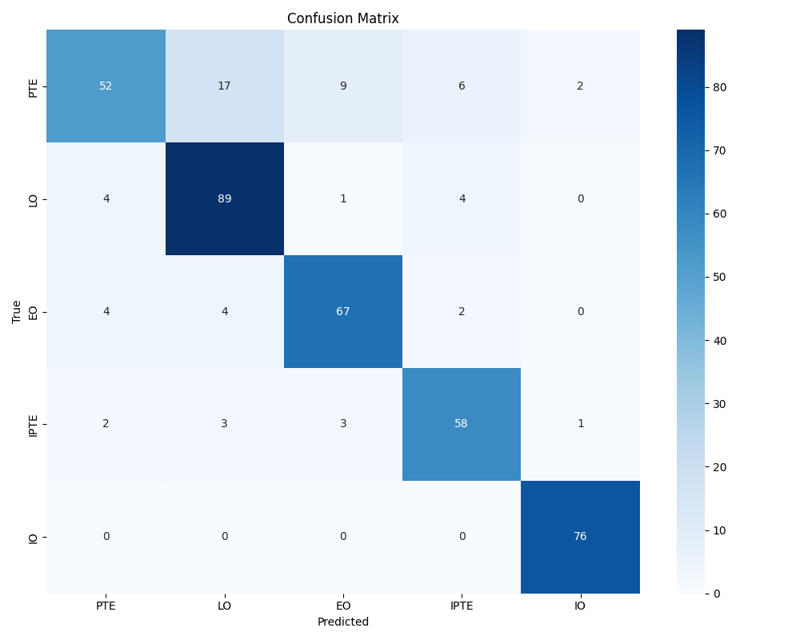
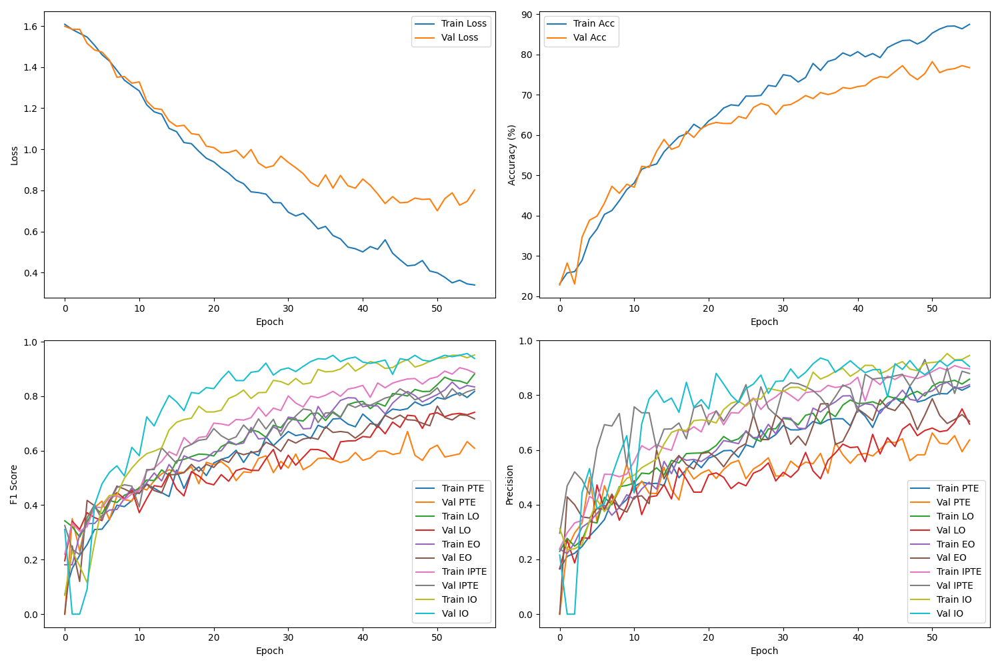

# Neuroflux Disorder Detection

A deep learning project for classifying different phases of Neuroflux disorder from medical images. The disease is an imaginary disease that has been created for this project.

## Overview

This project implements two deep learning models to classify medical images into five different phases of Neuroflux disorder:

-   EO: Early Onset Neuroflux disorder
-   IO: Intermediate onset Neuroflux disorder
-   LO: Late Onset Neuroflux disorder
-   PTE: Neuroflux disorder with polyglutamine tract expansion
-   IPTE: Neuroflux disorder with intermediate polyglutamine tract expansion

## Project Structure

```
.
├── data/                  # Dataset directory (not included in repository)
│   ├── EO/                # Early Onset Neuroflux disorder images
│   ├── IO/                # Intermediate onset Neuroflux disorder images
│   ├── LO/                # late Onset Neuroflux disorder images
│   ├── PTE/               # Neuroflux disorder with polyglutamine tract expansion images
│   └── IPTE/              # Neuroflux disorder with intermediate polyglutamine tract expansion images
├── README.md
├── src
│   ├── dataset.py        # PyTorch Dataset implementation for loading and preprocessing images
│   ├── hyperparameter_tuning.py  # Hyperparameter tuning using optuna
│   ├── __init__.py       # Python package marker file
│   ├── main.py           # Entry point of the application, handles CLI and orchestrates workflows
│   ├── models
│   │   ├── model_factory.py  # Model factory for creating and loading models
│   │   ├── neuroflux.py      # Custom model implementation
│   ├── training.py       # Training loop implementation with validation and early stopping
│   └── utils
│       ├── config_loader.py      # JSON configuration file loader
│       ├── data_augmenter.py     # Data augmentation and dataset balancing utilities
│       ├── file_utils.py         # File operations and data splitting utilities
│       ├── __init__.py           # Python package marker file
│       ├── preprocessing.py      # MRI image preprocessing and quality improvement
│       └── transforms.py         # Image transformation pipelines for training and validation
├── Dockerfile            # Instructions for building the Docker container
├── uv.lock              # Dependency lock file for uv package manager
└── pyproject.toml       # Project configuration and dependencies
```

# Getting Started

## Requirements

-   Python 3.8+
-   PyTorch
-   CUDA (for GPU acceleration)
-   Docker (for containerization)
-   Nvidia Container Toolkit (for GPU acceleration in Docker)

## Installation

1. Clone the repository:

```bash
git clone https://github.com/pierrelouisdelx/NeurofluxDisorderDetection.git
cd NeurofluxDisorderDetection
```

2. Install dependencies:

In order to install the dependencies uv is required. If you do not have uv installed, please refer to the [installation guide](https://docs.astral.sh/uv/getting-started/installation/)

```bash
uv sync
```

## Downloading the Dataset

The dataset can be downloaded from [https://cdn.orbs.cloud/data.zip](https://cdn.orbs.cloud/data.zip).
Extract the zip file in the root of the repository.

```bash
wget https://cdn.orbs.cloud/data.zip
unzip data.zip
```

## Usage

The main entry point of the application is located in `src/main.py` and handles different modes of operation for the Neuroflux Disorder Phase Classifier.

Modes:

-   `preprocess`: Analyze and preprocess the dataset
-   `train`: Train the model
-   `evaluate`: Evaluate the model on test data
-   `predict`: Make predictions on a single image

If you want to skip the training part, you can download the pre-trained models from [https://cdn.orbs.cloud/resnet50_model.pth](https://cdn.orbs.cloud/resnet50_model.pth) and [https://cdn.orbs.cloud/neuroflux_model.pth](https://cdn.orbs.cloud/neuroflux_model.pth) and put them in the `output/saved_models` folder.

### Training Models

:warning: The training on the custom model is sometimes unstable and the model may not converge. I am still trying to figure out why this is happening. If your model does not converge, please download the pre-trained model from the link above. This issue does not happen with the ResNet50 model.

The dataset configuration file is located in the `configs` folder. It has a very simple structure:

```json
{
    "data_dir": "data", # Path to the dataset
    "image_size": [224, 224], # Size of the images
    "train_val_test_split": [0.7, 0.15, 0.15], # Split of the dataset into train, validation and test
    "num_workers": 4, # Number of workers for the dataloader
    "random_seed": 42, # Random seed for the dataset
    "class_names": ["PTE", "LO", "EO", "IPTE", "IO"] # Names of the classes
}
```

Each model has its own configuration file located in the `configs` folder. The configuration files are named as follows:

-   `resnet50_config.json`: Configuration for the ResNet50 model

    ```json
    {
        "model_name": "resnet50",
        "learning_rate": 1e-3,
        "weight_decay": 1e-4,
        "num_epochs": 50,
        "model_save_path": "saved_models/resnet50_model.pth",
        "batch_size": 16,
        "lr_factor": 0.5,
        "lr_patience": 3,
        "hyperparams": {
            "hidden_size": 512,
            "dropout_rate": 0.6
        }
    }
    ```

-   `neuroflux_config.json`: Configuration for the custom model

    ```json
    {
        "model_name": "neuroflux",
        "learning_rate": 1e-3,
        "weight_decay": 1e-4,
        "num_epochs": 100,
        "model_save_path": "saved_models/neuroflux_model.pth",
        "batch_size": 16,
        "lr_factor": 0.5,
        "lr_patience": 5,
        "hyperparams": {
            "conv_channels": 64,
            "dropout_rate": 0.5
        }
    }
    ```

To train the model

```bash
uv run src/main.py train --dataset_config configs/dataset_config.json --model_config configs/<model_name>_config.json
```

#### Training Progress

The training progress is logged in the `output/runs` directory. To monitor the training progress, the tensorboard command can be used:

```bash
tensorboard --logdir=output/runs
```

### Evaluation

To evaluate the model performances:

```bash
uv run src/main.py evaluate --dataset_config configs/dataset_config.json --model_config configs/<model_name>_config.json
```

### Prediction

To predict the phase of a new MRI scan:

```bash
uv run src/main.py predict --image_path path/to/image.jpg --dataset_config configs/dataset_config.json --model_config configs/<model_name>_config.json
```

## Docker Usage

In order to be able to use the models with Docker, nvidia-container-toolkit is required. Please refer to the [installation guide](https://docs.nvidia.com/datacenter/cloud-native/container-toolkit/install-guide.html) for more information.

### Building the Docker Image

:warning: The dockerfile is using the pytorch/pytorch:2.7.0-cuda12.6-cudnn9-devel image. This image is using cuda 12.6 and cudnn 9.0, please check your GPU to see if it is compatible with this version. If you want to use a different version of cuda and cudnn, you can change the image in the dockerfile.

```bash
docker build -t neuroflux-detection .
```

### Running with Docker

```bash
docker run --gpus all neuroflux-detection [train|evaluate|predict] --dataset_config configs/dataset_config.json --model_config <model_config>
```

# Data Preparation

## Initial Observations

The dataset provided was highly imbalanced and contained many low-quality images. The first step was to clean the dataset by removing these low-quality images.

## Preprocessing

The preprocessing step consisted of the following:

-   Resizing the images to 224x224
-   Converting the images to grayscale
-   Normalizing the pixel values

I also created the MRIPreprocessor class in `src/utils/preprocessing.py`. This class contains the following methods:

-   `analyze_dataset`: Computes statistics such as intensity, contrast, signal-to-noise ratio (SNR), and entropy for each image in the dataset. These statistics are stored and used for further analysis.
-   `detect_outliers`: Identifies outlier images using statistical methods. It calculates z-scores for each image based on the computed statistics and flags images with z-scores above a specified threshold as outliers.
-   `visualize_dataset_tsne`: Visualizes the dataset using t-SNE to identify clusters and potential problems. It also applies DBSCAN clustering to find clusters within the t-SNE results.
-   `preprocess_image`: Applies various preprocessing methods to an image, such as normalization, contrast enhancement (CLAHE), denoising, and histogram equalization.

The main purpose of the MRIPreprocessor class is to analyze the dataset and detect outliers in order to remove them from the dataset.

## Data Augmentation

To address the imbalance in the dataset, a data augmentation script was developed. This script generates an equal number of images for each class using the following transformations:

```python
self.augmentation_transforms = transforms.Compose(
    [
        transforms.RandomHorizontalFlip(p=0.5),
        transforms.RandomAffine(degrees=(-15, 15), scale=(0.9, 1.1)),
    ]
)
```

Once the augmented data was created, the augmented dataset is merged with the original dataset and the outliers are removed from the dataset. All of this happens in the `src/utils/data_augmenter.py` file.

## Model Development

### Model 1: Transfer Learning with ResNet50

A pre-trained ResNet50 model was fine-tuned to classify the phases of Neuroflux disorder. This approach leverages transfer learning to improve the model's performance. The following modifications were made to the ResNet50 architecture:

1. Layer Freezing: Most of the pre-trained layers were frozen to preserve the learned features. Specifically, all layers before layer4 (the last block) were frozen to prevent overfitting and maintain the model's ability to extract general features.

2. Custom Classification Head: The original fully connected layer was replaced with a more sophisticated classification head:
    - A linear layer reducing the features to a hidden size (default: 512)
    - Batch normalization for better training stability
    - ReLU activation
    - Dropout layer (default rate: 0.6) for regularization
    - Final linear layer mapping to the 5 output classes

This architecture modification allows the model to:

-   Leverage pre-trained weights for feature extraction
-   Fine-tune only the most relevant layers for the specific task
-   Prevent overfitting through dropout and batch normalization
-   Adapt the output to the specific 5-class classification problem

### Model 2: Custom CNN

A custom Convolutional Neural Network (CNN) was designed and trained from scratch. The architecture of the custom model is as follows:

```
==========================================================================================
Layer (type:depth-idx)                   Output Shape              Param #
==========================================================================================
NeurofluxModel                           [1, 5]                    --
├─Conv2d: 1-1                            [1, 32, 224, 224]         896
├─MaxPool2d: 1-2                         [1, 32, 112, 112]         --
├─Conv2d: 1-3                            [1, 64, 112, 112]         18,496
├─MaxPool2d: 1-4                         [1, 64, 56, 56]           --
├─Conv2d: 1-5                            [1, 128, 56, 56]          73,856
├─MaxPool2d: 1-6                         [1, 128, 28, 28]          --
├─Conv2d: 1-7                            [1, 256, 28, 28]          295,168
├─MaxPool2d: 1-8                         [1, 256, 14, 14]          --
├─Flatten: 1-9                           [1, 50176]                --
├─Linear: 1-10                           [1, 256]                  12,845,312
├─Dropout: 1-11                          [1, 256]                  --
├─Linear: 1-12                           [1, 5]                    1,285
==========================================================================================
Total params: 13,235,013
Trainable params: 13,235,013
Non-trainable params: 0
Total mult-adds (Units.MEGABYTES): 752.84
==========================================================================================
```

## Hyperparameter Tuning

Optuna was used for hyperparameter tuning to optimize the performance of both models. Training progress was monitored using TensorBoard. All training and hyperparameter tuning were done on a T4 GPU on Kaggle. In order to run the hyperparameter tuning, the `src/hyperparameter_tuning.py` file can be used.

```bash
uv run src/hyperparameter_tuning.py --dataset_config configs/dataset_config.json --model_config configs/<model_name>_config.json
```

## Hyperparameter Tuning Details

The hyperparameter tuning process uses Optuna to optimize several key parameters for both models. Here's a detailed breakdown of the tuned hyperparameters:

### Common Hyperparameters for Both Models

1. **Optimizer Selection and Parameters**:

    - Optimizer type: Adam, AdamW, SGD, or RMSprop
    - Learning rate: 1e-5 to 1e-3 (log scale)
    - Weight decay: 1e-5 to 1e-3 (log scale)
    - For Adam/AdamW: beta1 (0.8-0.99) and beta2 (0.9-0.9999)
    - For SGD: momentum (0.8-0.99) and nesterov momentum (True/False)
    - For RMSprop: momentum (0.8-0.99) and alpha (0.8-0.99)

2. **Learning Rate Scheduler**:

    - Scheduler type: ReduceLROnPlateau, CosineAnnealingLR, or OneCycleLR
    - For ReduceLROnPlateau:
        - Factor: 0.1-0.5
        - Patience: 3-10 epochs
        - Minimum learning rate: 1e-6 to 1e-4
    - For CosineAnnealingLR:
        - T_max: 10-100
        - Minimum learning rate: 1e-6 to 1e-4
    - For OneCycleLR:
        - Maximum learning rate: 1e-4 to 1e-2
        - Total steps: 100-1000
        - Percentage of warmup: 10-30%
        - Division factors: 10-100 (initial), 100-1000 (final)

3. **Training Parameters**:
    - Batch size: 16, 32, or 64
    - Dropout rate: 0.3 to 0.7

### Model-Specific Hyperparameters

1. **ResNet50 Model**:

    - Hidden size: 256, 512, or 1024 (for the custom classification head)

2. **Custom Neuroflux Model**:
    - Convolutional channels: 16, 32, or 64 (for the initial convolutional layer)

The optimization process runs for 50 trials with a 1-hour timeout, using validation accuracy as the optimization metric. The best hyperparameters are saved in JSON format in the `output/hyperparameter_tuning` directory.

## Performance Metrics

The models are evaluated using multiple metrics:

-   Accuracy
-   Precision
-   Recall
-   F1-Score
-   Confusion Matrix

## Results

### Model 1: Transfer Learning with ResNet50

Training results of the transfer learning using the ResNet50 model without any hyperparameter tuning on an T4 GPU on Kaggle are as follows:

```
              precision    recall  f1-score   support

         PTE       0.84      0.60      0.70        86
          LO       0.79      0.91      0.84        98
          EO       0.84      0.87      0.85        77
        IPTE       0.83      0.87      0.85        67
          IO       0.96      1.00      0.98        76

    accuracy                           0.85       404
   macro avg       0.85      0.85      0.85       404
weighted avg       0.85      0.85      0.84       404

```




The results for the ResNet50 model with hyperparameter tuning are as follows:

**_Coming soon_**

### Model 2: Custom CNN

Training results of the custom CNN model without any hyperparameter tuning on an T4 GPU on Kaggle are as follows:

```
              precision    recall  f1-score   support

         PTE       0.71      0.59      0.65        76
          LO       0.82      0.76      0.79        95
          EO       0.76      0.82      0.79        72
        IPTE       0.90      0.91      0.91        81
          IO       0.85      0.99      0.91        81

    accuracy                           0.81       405
   macro avg       0.81      0.81      0.81       405
weighted avg       0.81      0.81      0.81       405
```




The results for the Neuroflux model with hyperparameter tuning are as follows:

**_Coming soon_**
